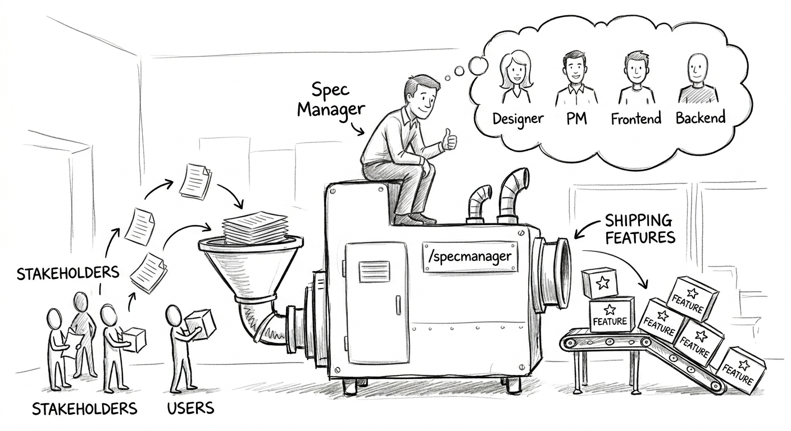

# SpecManager

A Claude Code plugin that turns your project's lifecycle — **PRD → Architecture → (Design) → Plan + tasks → Build → Walkthroughs** — into a localhost kanban board backed by plain markdown in your repo.

Claude *drafts* each stage from the previous approved one **and your existing codebase**; you *edit and approve* in the board. Every artifact is git-tracked markdown, so it diffs, reviews, and travels with the code. Single-user, fully local, no auth, bound to `127.0.0.1`.

---



## Quick start

```text
# 1. Add the marketplace (from GitHub, or a local checkout)
/plugin marketplace add joanseg/specmanager
#   /plugin marketplace add /path/to/specmanager     ← local clone

# 2. Install
/plugin install specmanager@specmanager

# 3. Restart Claude Code so the MCP server boots (it also starts the board)

# 4. In your project, scaffold SpecManager and open the board
/specmanager-init
/specmanager-board
```

That's it — no build step. The compiled server and UI are committed, and a `SessionStart` hook installs runtime dependencies into the plugin's data dir on first launch.

**Requirements:** Node 20+ and Claude Code. The board runs at `http://127.0.0.1:4317` (change the port in the plugin's user config).

---

## The workflow

Each **feature** is a row on the board that flows left to right through the lifecycle. You drive it with slash commands; Claude does the drafting via dedicated subagents, and you approve each stage in the board before the next unlocks.

```text
/specmanager-feature "Checkout corridor"   # new feature pipeline (a board row)
/specmanager-prd            <feature>       # draft the PRD            → approve in board
/specmanager-architecture   <feature>       # draft the Architecture   → approve in board
/specmanager-design         <feature>       # OPTIONAL high-fi HTML mockups → approve
/specmanager-plan           <feature>       # plan.md + phased tasks   → approve in board
/specmanager-execute        <feature> next  # build one phase at a time
/specmanager-walkthrough    <feature> <phase>   # per-phase walkthrough
/specmanager-walkthrough    <feature> final     # feature-level roll-up
/specmanager-board                          # open the kanban board anytime
```

`<feature>` is the feature's slug or id (from `/specmanager-feature`).

### Stages and gates

| Stage | Produces | Unlocks when |
|-------|----------|--------------|
| **PRD** | `press-release.md`, `prd.md` | always (the entry point) |
| **Architecture** | `architecture.md` | PRD approved |
| **Design** *(optional)* | high-fidelity HTML mockups | PRD approved (runs in parallel with Architecture) |
| **Plan** | `plan.md` + task records (`tasks.json`, rollup) | Architecture approved (and Design, if one exists, approved) |
| **Build** | *no doc — it's execution* | Plan approved |
| **Walkthroughs** | `<slug>.md` per phase + a final roll-up | the phase's tasks are all `done` |

Gates are enforced in shared code, not in prompts — Claude **cannot** draft a stage whose gate is closed. Plans are organised into **phases**, each a testable, runnable increment; tasks carry a Fibonacci `complexity` score and anything over 3 must be split. `/specmanager-execute` builds one phase and stops at its boundary.

### Living docs

`approved` is a commitment, not a freeze. Reopen an approved doc and every downstream doc that depended on it gets a non-blocking **stale** badge — a "the basis changed, review me" signal. Regenerate or re-approve to clear it.

---

## The board

`/specmanager-board` opens a grid: **one row per feature, one column per stage** (PRD · Architecture · Design · Plan · Build · Walkthroughs). It updates live over websockets as Claude writes docs or you edit them.

- Each cell is a card showing status (`draft`/`approved`), a stale badge, and whether it was generated by agent or human.
- Clicking a card opens a **doc panel** drawer over the dimmed board to read, edit, and approve. Design docs get a CodeMirror HTML editor with a live sandboxed `<iframe>` preview.
- The **Build** cell groups tasks under collapsible phase headers with per-phase progress bars instead of a document.
- The **Walkthrough** column shows one card per phase plus a final roll-up card that stays locked until every phase walkthrough is approved.

Edits you make in the board and writes Claude makes both flow through the same shared logic layer, so the two views never drift. AI writes use optimistic concurrency, so a stale agent write can't clobber your manual edits.

---

## Where your work lives

Everything is markdown with YAML frontmatter under your project, version-controlled by git:

```text
<your-project>/
  CLAUDE.md                         # carries a managed SpecManager block (between markers)
  docs/DESIGN.md                    # managed design-system spec (inferred from your UI)
  .claude/specs/
    manifest.json                   # rebuildable board index (derived from frontmatter)
    features/<slug>/
      feature.json
      prd/        press-release.md, prd.md
      architecture/ architecture.md
      design/     <mockups>.html
      plan/       plan.md, tasks.md, tasks.json
      walkthroughs/ <slug>.md
```

Frontmatter is authoritative; `manifest.json` is a cache you can delete and rebuild. The managed regions in `CLAUDE.md` and `DESIGN.md` live strictly between `<!-- specmanager:start -->` / `<!-- specmanager:end -->` markers — nothing outside them is ever touched.

---

## Contributing / building from source

The plugin ships its compiled `server/dist` and `ui/dist`, so users install with no build step. Rebuild before committing source changes:

```bash
cd plugins/specmanager/server
npm install
npm run build
npm run selftest          # core flow against a tmp dir
npm run selftest-board    # boots board: REST + WS + file watcher
npm run selftest-phases   # phase rollup + Fibonacci ≤3 validation
npm run selftest-execute  # per-phase gates + walkthrough storage
npm run smoke-mcp         # MCP wire protocol + tools registered

cd ../ui
npm install
npm run build             # → ui/dist, served by the board server
```

Then reinstall in a test repo:

```text
/plugin marketplace update specmanager
/plugin install specmanager@specmanager
/reload-plugins
```

**Tech stack:** Node 20+, TypeScript, MCP stdio transport, Fastify + `ws`, `chokidar`, `gray-matter`, `zod`, React 18 + Vite, CodeMirror 6. One shared `@specmanager/core` library backs both the MCP server (Claude's interface) and the board server (the UI's interface); one MCP process boots the board.

**Repo layout:** the marketplace manifest is at the repo root (`.claude-plugin/marketplace.json`); the plugin itself lives in `plugins/specmanager/`. Architecture and design docs are under `docs/` — start with `docs/architecture-and-spec.md`.

---

## Troubleshooting

- **`/mcp` shows specmanager failed** — select it and reconnect. If it persists, fully restart: quit Claude (`Ctrl-C` twice), `claude daemon stop`, kill stragglers (`ps aux | grep mcp.js`), confirm the port is free (`lsof -nP -iTCP:4317 -sTCP:LISTEN`), then relaunch `claude` from your project.
- **Board won't open** — the MCP process boots the board server on startup; if it isn't running, restart your Claude session. `/specmanager-board` reports the URL so you can open it manually.
- **`/reload-plugins` reports a load error** — do the full restart above rather than retrying the reload.
