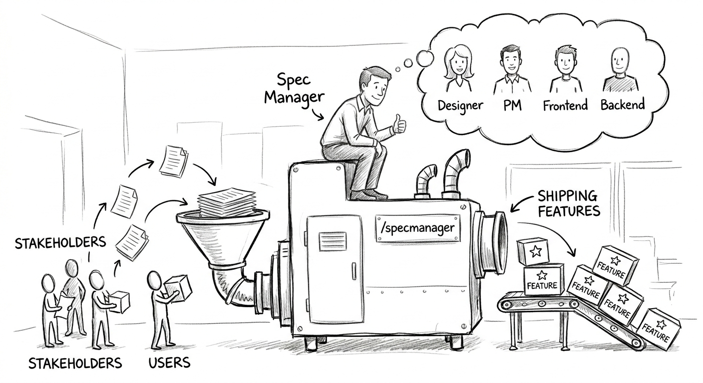

# SpecManager

**Your AI product team, as a Claude Code plugin.**

As a non technical founder or product vibe coder you already have the builder — Claude Code. What you *don't* have is the rest of the team: the product manager who pins down the problem, the architect who fits it to your codebase, the planner who breaks it into shippable pieces, the reviewer who checks the work against the plan.

SpecManager is that team. It gives you a set of specialised AI agents organised like an agile squad: the agents draft, **you** review, edit, and approve, and you decide what moves forward. It's **spec-driven development** you can actually see — a kanban board running on your own machine, one row per feature, one column per stage: **PRD → Architecture → (Design) → Plan → Build → Walkthroughs.**

Everything the team produces is plain markdown saved inside your project, so it reads like documents, not code, and your version history keeps every draft. It runs entirely on your own machine — single-user, private, no login.

[specmanager.org](https://specmanager.org) · MIT licensed

---



## Your team

Each role is its own specialised agent — not one mega-prompt wearing different hats:

- **Product manager** — drafts the PRD, and can run an optional pre-PRD interview that pulls the idea out of your head and stress-tests it before you write anything down.
- **Architect** — reads your actual codebase (its structure, conventions, the pieces already there) before designing, so "we'll add X" always points at something real instead of a guess.
- **Designer** *(optional)* — produces high-fidelity screen mockups grounded in a shared design system, so the look stays consistent across features.
- **Tech lead** — breaks the architecture into phases and small, scored tasks, defaulting to the smallest increment that actually ships something.
- **Builder** — implements one phase at a time, task by task, saving its work as it goes.
- **Reviewer** — read-only; checks each finished phase against the spec and returns a plain pass/fail verdict. It can't change anything.
- **Tech writer** — documents what actually shipped, per phase, so you always have a record.

The agents hand off to each other through approved documents, not a hidden shared memory — and **none of them approves its own work. That's your call.** You stay in the loop by design: an agent can't move to the next stage until you've approved the current one. Claude can't start the Architecture until you've approved the PRD, because that rule lives in the software itself, not in instructions the AI could talk its way around.

**"Approved" is a commitment, not a freeze.** Reopen an earlier document and every later one that depended on it gets a gentle "stale — worth a re-read" badge that follows the chain of dependencies. And because edits are tracked carefully, a late agent write can never overwrite a change you made by hand.

## Good habits, built in

The team comes with established product and engineering practice baked in — and when you have the matching Claude Code skills installed, the agents defer to them automatically (and work fine without them):

- **Sharper idea stress-testing** — the optional pre-PRD interview uses the [gstack office-hours](https://github.com/garrytan/gstack/tree/main/office-hours) forcing-question method to interrogate an idea *before* any PRD exists, like the cofounder who asks "who is actually desperate for this today?"
- **Agile planning discipline** — a phase is defined as a working, testable increment; the planner defaults to a single phase and has to ask before splitting one. Tasks are scored, and anything too big must be broken down.
- **Up-to-date library docs** — the architect (and only the architect, on demand) can look up real, version-current documentation for unfamiliar tools instead of relying on memory. No setup or key required.
- **Visual taste** — the designer and builder defer to the official `frontend-design` skill when it's installed, layered on top of your design system, which stays the source of truth.
- **Execution discipline** — the builder defers to Superpowers, when installed, for *how* it carries out each task.

## Quick start

```text
# 1. Add the marketplace (from GitHub)
/plugin marketplace add joanseg/specmanager

# 2. Install
/plugin install specmanager@specmanager

# 3. Reload plugins
/reload-plugins

# 4. Reconnect MCP server
/mcp       ## If plugin:specmanager:specmanager ✘ failed select and click enter to reconnect

# 5. In your project, scaffold SpecManager and open the board
/specmanager:specmanager-init
/specmanager:specmanager-board

# 6. Kick off the first feature or MVP
/specmanager:specmanager-interview about a CRM to manage sales pipeline in my company
```
Example of a Specmanager board:


That's it — no build step. The compiled server and UI are committed, and a `SessionStart` hook installs runtime dependencies into the plugin's data dir on first launch.

**Requirements:** Node 20+ and Claude Code. The board runs at `http://127.0.0.1:4317` (change the port in the plugin's user config).

---

## The workflow

Each **feature** is a row on the board that flows left to right through the lifecycle. You drive it with slash commands; Claude does the drafting via dedicated subagents, and you approve each stage in the board before the next unlocks.

```text
/specmanager:specmanager-interview "Checkout corridor" # OPTIONAL pre-PRD interview — extracts & stress-tests the idea
/specmanager:specmanager-prd "Checkout corridor"       # create the feature + draft its PRD → approve in board
/specmanager:specmanager-architecture   <feature>       # draft the Architecture   → approve in board
/specmanager:specmanager-design         <feature>       # OPTIONAL high-fi HTML mockups → approve
/specmanager:specmanager-plan           <feature>       # plan.md + phased tasks   → approve in board
/specmanager:specmanager-build          <feature> next  # build one phase at a time
/specmanager:specmanager-walkthrough    <feature> <phase>   # per-phase walkthrough
/specmanager:specmanager-walkthrough    <feature> final     # feature-level roll-up
/specmanager:specmanager-board                          # open the kanban board anytime
```

`<feature>` is the feature's slug or id (reported by `/specmanager:specmanager-prd` when it creates the feature).

`/specmanager:specmanager-interview` is optional: a multi-turn interview in your Claude session that pulls the idea out of your head and challenges it (using the [gstack office-hours](https://github.com/garrytan/gstack/tree/main/office-hours) forcing-question method) before any PRD exists. The result can be stored as `interview.md` in the feature's PRD folder — shown as a chip on the board, never gating anything — and the PRD drafter grounds itself in it when present.

### Stages and gates

| Stage | Produces | Unlocks when |
|-------|----------|--------------|
| **Interview** *(optional)* | `interview.md` | recommended starting point, challenges your ideas and extracts context|
| **PRD** | `prd.md` | always (the entry point after interview if exists) |
| **Architecture** | `architecture.md` | PRD approved |
| **Design** *(optional)* | high-fidelity HTML mockups | PRD approved (runs in parallel with Architecture) |
| **Plan** | `plan.md` + task records (`tasks.json`, rollup) | Architecture approved (and Design, if one exists, approved) |
| **Build** | *no doc — it's execution* | Plan approved |
| **Walkthroughs** | `<slug>.md` per phase + a final roll-up | the phase's tasks are all `done` |

Gates are enforced in shared code, not in prompts — Claude **cannot** draft a stage whose gate is closed. Plans are organised into **phases**, each a testable, runnable increment; tasks carry a Fibonacci `complexity` score and anything over 3 must be split. `/specmanager:specmanager-build` builds one phase and stops at its boundary.

### Living docs

`approved` is a commitment, not a freeze. Reopen an approved doc and every downstream doc that depended on it gets a non-blocking **stale** badge — a "the basis changed, review me" signal. Regenerate or re-approve to clear it.

---

## The board

`/specmanager:specmanager-board` opens a grid: **one row per feature, one column per stage** (PRD · Architecture · Design · Plan · Build · Walkthroughs). It updates live over websockets as Claude writes docs or you edit them.

- Each cell is a card showing status (`draft`/`approved`), a stale badge, and whether it was generated by agent or human.
- Clicking a card opens a **doc panel** drawer over the dimmed board to read, edit, and approve. Design docs get a CodeMirror HTML editor with a live sandboxed `<iframe>` preview.
- The **Build** cell groups tasks under collapsible phase headers with per-phase progress bars instead of a document.
- The **Walkthrough** column shows one card per phase plus a final roll-up card that stays locked until every phase walkthrough is approved.

Edits you make in the board and writes Claude makes both flow through the same shared logic layer, so the two views never drift. AI writes use optimistic concurrency, so a stale agent write can't clobber your manual edits.

---

## Where your work lives

Everything is markdown with YAML frontmatter under your project, version-controlled by git.

Option 1: run in inside the repo:

```text
<your-project>/
  CLAUDE.md                         # carries a managed SpecManager block (between markers)
  docs/DESIGN.md                    # managed design-system spec (inferred from your UI)
  .claude/specs/
    manifest.json                   # rebuildable board index (derived from frontmatter)
    features/<slug>/
      feature.json
      prd/        press-release.md, prd.md
      architecture/ architecture.md
      design/     <mockups>.html
      plan/       plan.md, tasks.md, tasks.json
      walkthroughs/ <slug>.md
```

Option 2: run it as a meta repo

```text
<meta-repo>/
  CLAUDE.md                         # carries a managed SpecManager block (between markers) and references <your-project-backend>/ and <your-project-frontend>/
  docs/DESIGN.md                    # managed design-system spec (inferred from your UI)
  .claude/specs/
    manifest.json                   # rebuildable board index (derived from frontmatter)
    features/<slug>/
      feature.json
      prd/        press-release.md, prd.md
      architecture/ architecture.md
      design/     <mockups>.html
      plan/       plan.md, tasks.md, tasks.json
      walkthroughs/ <slug>.md
<your-project-backend>/
...
<your-project-frontend>/
...

```


Frontmatter is authoritative; `manifest.json` is a cache you can delete and rebuild. The managed regions in `CLAUDE.md` and `DESIGN.md` live strictly between `<!-- specmanager:start -->` / `<!-- specmanager:end -->` markers — nothing outside them is ever touched.

---

## Contributing / building from source

The plugin ships its compiled `server/dist` and `ui/dist`, so users install with no build step. Rebuild before committing source changes:

```bash
cd plugins/specmanager/server
npm install
npm run build
npm run selftest          # core flow against a tmp dir
npm run selftest-board    # boots board: REST + WS + file watcher
npm run selftest-phases   # phase rollup + Fibonacci ≤3 validation
npm run selftest-build    # per-phase gates + walkthrough storage
npm run smoke-mcp         # MCP wire protocol + tools registered

cd ../ui
npm install
npm run build             # → ui/dist, served by the board server
```

Then reinstall in a test repo:

```text
/plugin marketplace update specmanager
/plugin uninstall specmanager@specmanager
/plugin install specmanager@specmanager
/reload-plugins
```
Close all Claude Code sessions.
Then open a Claude Code session and reconnect mcp:
```
/mcp      ## select specmanager:specmanager, click enter and reconnect 
```

**Tech stack:** Node 20+, TypeScript, MCP stdio transport, Fastify + `ws`, `chokidar`, `gray-matter`, `zod`, React 18 + Vite, CodeMirror 6. One shared `@specmanager/core` library backs both the MCP server (Claude's interface) and the board server (the UI's interface); one MCP process boots the board.

**Repo layout:** the marketplace manifest is at the repo root (`.claude-plugin/marketplace.json`); the plugin itself lives in `plugins/specmanager/`. Design docs are under `docs/` (the original full spec is archived at `docs/temp/original-specs/architecture-and-spec.md`).

---

## Troubleshooting

- **`/mcp` shows specmanager failed** — select it and reconnect. If it persists, fully restart: quit Claude (`Ctrl-C` twice), `claude daemon stop`, kill stragglers (`ps aux | grep mcp.js`), confirm the port is free (`lsof -nP -iTCP:4317 -sTCP:LISTEN`), then relaunch `claude` from your project.
- **Board won't open** — the MCP process boots the board server on startup; if it isn't running, restart your Claude session. `/specmanager:specmanager-board` reports the URL so you can open it manually.
- **`/reload-plugins` reports a load error** — do the full restart above rather than retrying the reload.

---

## Links

- Website: <https://specmanager.org>

## License

[MIT](LICENSE) © 2026-present [Joanseg](https://github.com/joanseg)
